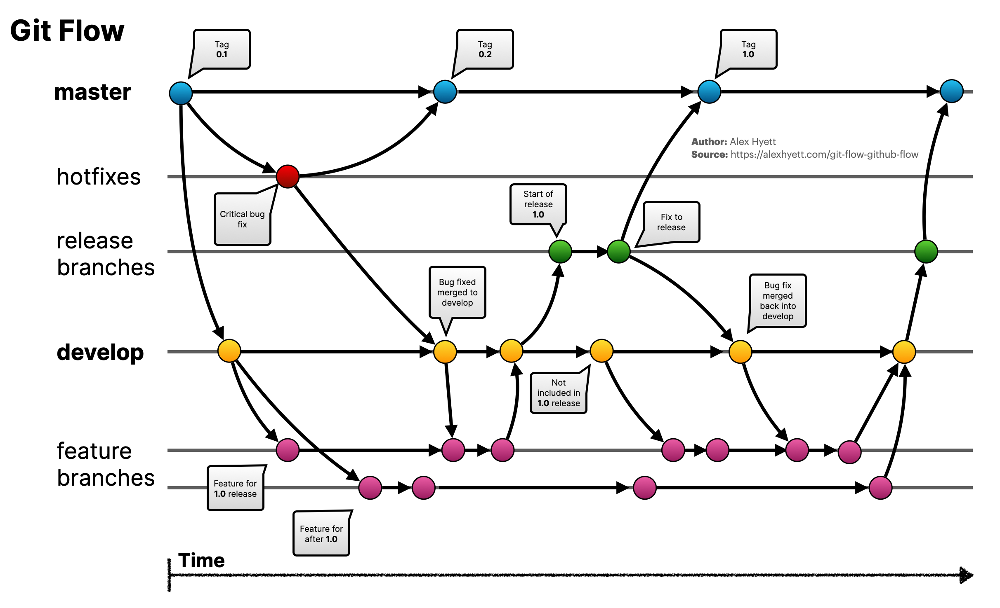
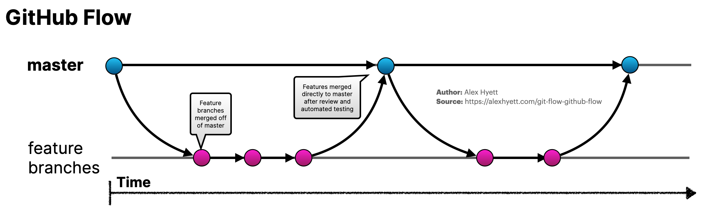

# Git Flow

Es ideal para proyectos que tengan un ciclo de publicacion programado, es decir que sale muy bien con metodologias agiles como scrum, es decir que en 15 dias o un mes tienes que entregar una nueva version de la aplicacion

## Nombramiento

- **Master**: Esta es la que inicial el repositorio
- **Develop**: Usada para desarrollar nuevas funcionalidades
- **Features/Fix**: Usada para desarrollar un cambio, feature o fix a la vez
- **Release**: Rama usada antes de publicar una nueva version del software, para estabilizacion
- **Bugfix**: Ramas dedidacas a corregir errores en **release**
- **Hotfix**: Rama dedicada a corregir errore en **master**

## Proceso inicial

- Se crea rama **develop** a partir de **main**.
- Se crea rama **relese** a partir de la **develop**.
- Se crean ramas **feature o fix** a partir de la **develop**.
- Se crean ramas **bugfix** a partir de **relese**
- Se crean ramas **hotfix** a partir de **main**

## Flows

### Featur/Fix -> Develop

- Se crea rama **feature/fix** desde **develop**.
- al terminar **feature/fix** se fusiona en **develop**.

### Develop -> Release

- Cuando se tiene un paquete de funcionalidades lista en **develop**, Se crea una nueva rama **release** con su nueva version proyectada
- Ya no se reciben nuevas uniones desde **develop** solo se aceptan **bugfix** sobre esta nueva rama

### BugFix -> Release

- Se crea rama **bugfix** desde **release**.
- al terminar **bugfix** se fusiona en **release**.

### Release -> Master | Release -> Develop

- Cuando la rama **release** paso por proceso de **QA** y esta completamente validado la funcionalidad
- se fusiona en **master** y se crear un **tag version**.
- Al mismo tiempo **release** debe fusionarse en **develop**
- **NOTA:** siempre se debe de fusionar tambien en **develp** para evitar problemas de sincronizacion

### Hotfix -> Master | Hotfix -> Develop

- Se crea rama **hotfix** desde **master**.
- Al terminar **hotfix** se fusiona con **master** y luego con **develop**
- **NOTA:** siempre se debe de fusionar tambien en **develp** para evitar problemas de sincronizacion

### Master -> Develop

- Esto solo es necesario en casos excepcionales, donde algun **hotfix**, no se fusion en **develop** de forma correcta o algun **release** no se fusiono correctamente en **develop**, pero si en **master**

## Infraestructura (Ambientes)

La estructura de gitflow, puede aplastarse para adapatarse a la dispobilidad de ambientes que se disponga.

### GitFlow

- Develop (test developers)
  - ⤴️ Feature/Fix (develop)
- Release (test QA)
  - ⤴️ BugFix (develop)
- Master (test Production)
  - ⤴️ HotFix (develop)

### GitFlow Flat

- Release (test QA)
  - ⤴️ Feature/Fix (develop)
- Master (test Production)
  - ⤴️ HotFix (develop)

### GitHub Flow

- Master (test QA - test Production)
  - ⤴️ Feature/Fix/Hotfix (develop)
