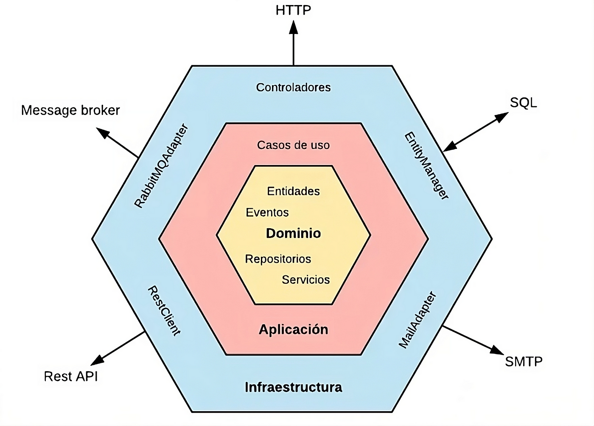
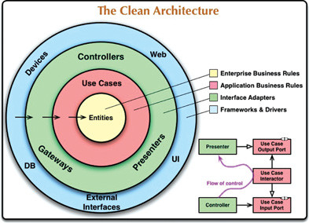
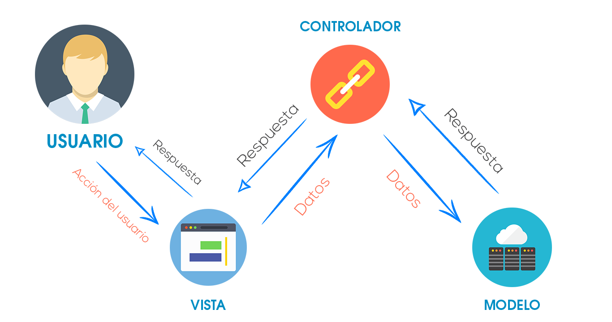
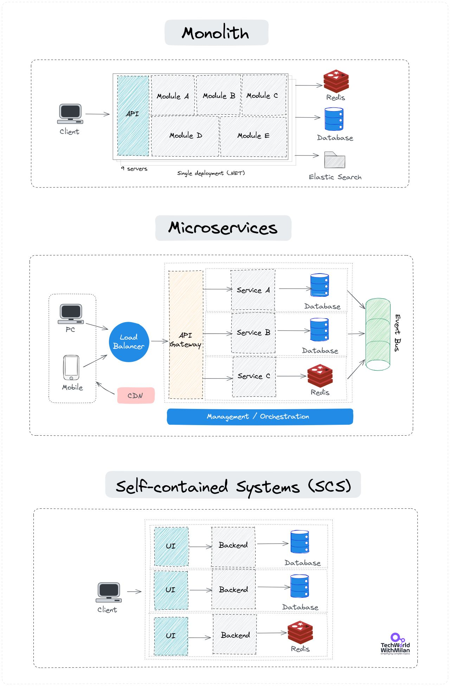
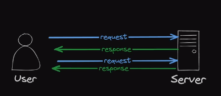
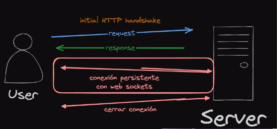
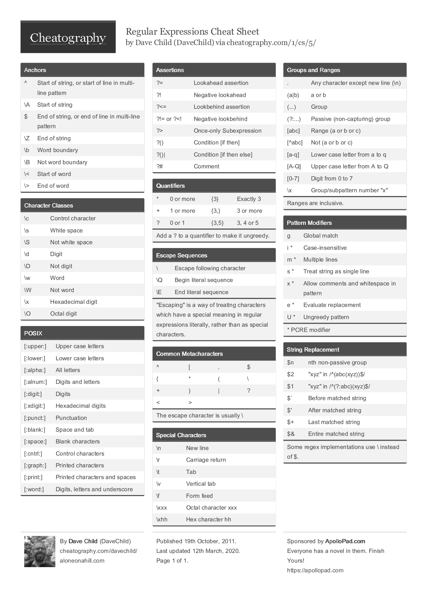

# Ingenieria de Software

## Metodología de diseño de software

la elección de la metodología adecuada depende de factores como el tipo de proyecto, los requisitos, el equipo de desarrollo y la cultura de la organización. En muchos casos, se adaptan o combinan metodologías para satisfacer las necesidades específicas del proyecto.

| Metodología                                | Descripción                                                                                           | Características principales                                                                                                          |
| ------------------------------------------ | ----------------------------------------------------------------------------------------------------- | ------------------------------------------------------------------------------------------------------------------------------------ |
| **Cascada (Waterfall)**                    | Enfoque secuencial y lineal, donde cada fase del desarrollo se completa antes de pasar a la siguiente | Adecuado para proyectos con requisitos bien definidos y estables                                                                     |
| **Desarrollo Ágil**                        | Incluye varios marcos y metodologías, como Scrum, Kanban y Extreme Programming (XP)                   | Se centran en la adaptabilidad, la colaboración y la entrega incremental. Ideales para proyectos donde los requisitos pueden cambiar |
| **Modelo en Espiral (Spiral Model)**       | Combina elementos de desarrollo en cascada con iteraciones y prototipado                              | Adecuado para proyectos grandes y complejos donde la gestión de riesgos es fundamental                                               |
| **Desarrollo Dirigido por Pruebas (TDD)**  | Se enfoca en escribir pruebas antes de desarrollar el código                                          | Promueve la calidad del software y la claridad de los requisitos                                                                     |
| **Domain-Driven Design (DDD)**             | Se centra en la modelización del dominio del negocio                                                  | Fomenta la colaboración entre expertos en el dominio y desarrolladores                                                               |
| **Desarrollo Basado en Componentes (CBD)** | Se enfoca en la reutilización de componentes de software                                              | Acelera el desarrollo y mejora la calidad                                                                                            |
| **Desarrollo en Pares (Pair Programming)** | Dos programadores trabajen juntos en el mismo código                                                  | Fomenta la revisión y la colaboración continua                                                                                       |
| **Métodos DevOps**                         | Combina el desarrollo y la operación de software                                                      | Permite una entrega continua y mayor colaboración entre equipos                                                                      |
| **Procesos Unificados (Unified Process)**  | Proporciona un marco de trabajo iterativo e incremental                                               | Se puede adaptar a diferentes tipos de proyectos                                                                                     |
| **Desarrollo de Software Lean**            | Se basa en los principios de Lean Manufacturing                                                       | Elimina el desperdicio y mejora la eficiencia en el desarrollo                                                                       |

### Domain-Driven Design (DDD)

Se centra en la modelización y organización del dominio del problema en el núcleo de una aplicación. Se ha convertido en un enfoque ampliamente adoptado en el desarrollo de software.

Busca crear un software más comprensible, mantenible y adaptable al enfocarse en el núcleo del negocio y utilizar un lenguaje común para describirlo. Ayuda a los equipos de desarrollo a colaborar de manera efectiva con los expertos en el dominio y a construir sistemas que reflejen con precisión las necesidades del negocio.

| Concepto                   | Descripción                                                                                                                                                                           |
| -------------------------- | ------------------------------------------------------------------------------------------------------------------------------------------------------------------------------------- |
| **Modelado del dominio**   | DDD pone un fuerte énfasis en comprender y representar el dominio del problema (las reglas y conceptos específicos del negocio) de manera precisa en el código                        |
| **Ubicuidad del lenguaje** | DDD promueve el uso de un lenguaje común y compartido entre los desarrolladores y los expertos en el dominio del negocio para evitar malentendidos y errores de comunicación          |
| **Agregados y entidades**  | DDD introduce conceptos como "agregados" y "entidades" para ayudar a estructurar el modelo de dominio de manera coherente y gestionar las relaciones entre objetos de manera efectiva |
| **Contextos delimitados**  | Se utilizan "contextos delimitados" para dividir el sistema en módulos que se centran en partes específicas del dominio y permiten la independencia y la escalabilidad                |
| **Capas de aplicación**    | DDD sugiere una arquitectura de capas, donde la capa de aplicación se encarga de la interacción entre el dominio y la interfaz de usuario o el sistema de persistencia                |

## Diagramas de software

### Diagramas UML

Los diagramas UML (Unified Modeling Language) son una notación estándar utilizada en la ingeniería de software para representar gráficamente sistemas y procesos. Estos diagramas se utilizan para visualizar, diseñar y comunicar la estructura, comportamiento y relaciones de componentes en un sistema de software

| Tipo de Diagrama             | Descripción                                                                                                                                   |
| ---------------------------- | --------------------------------------------------------------------------------------------------------------------------------------------- |
| **Diagrama de Clases**       | Modela la estructura estática de un sistema, mostrando las clases, sus atributos y relaciones entre ellas                                     |
| **Diagrama de Secuencia**    | Representa la interacción entre objetos a lo largo del tiempo, mostrando cómo se comunican en un escenario específico                         |
| **Diagrama de Casos de Uso** | Se utiliza para identificar y visualizar las interacciones entre actores (usuarios) y el sistema, describiendo las funcionalidades que ofrece |
| **Diagrama de Actividad**    | Se utiliza para modelar el flujo de actividades o procesos dentro de un sistema, incluyendo acciones, decisiones y ramificaciones             |
| **Diagrama de Estado**       | Representa los estados posibles de un objeto y cómo cambia entre ellos en respuesta a eventos                                                 |
| **Diagrama de Componentes**  | Muestra la estructura física de un sistema, incluyendo sus componentes, archivos y dependencias                                               |
| **Diagrama de Despliegue**   | Describe cómo los componentes de software se distribuyen en hardware físico, como servidores y dispositivos                                   |

### Diagramas C4

Los diagramas C4 (Context, Container, Component, Code) son una serie de diagramas de arquitectura de software que proporcionan una forma efectiva de representar la arquitectura de un sistema en varios niveles de abstracción.

| Tipo de Diagrama                                 | Descripción                                                                                                                                                                |
| ------------------------------------------------ | -------------------------------------------------------------------------------------------------------------------------------------------------------------------------- |
| **Context Diagram (Diagrama de Contexto)**       | Muestra el sistema en cuestión y sus relaciones de alto nivel con otros sistemas, proporcionando una vista de contexto de alto nivel                                       |
| **Container Diagram (Diagrama de Contenedores)** | Se centra en los contenedores de software, como aplicaciones, servicios o bases de datos, y sus relaciones, brindando una vista más detallada de la estructura del sistema |
| **Component Diagram (Diagrama de Componentes)**  | Describe los componentes internos de los contenedores, mostrando cómo se organizan y comunican entre sí                                                                    |
| **Code Diagram (Diagrama de Código)**            | Si es necesario, se pueden crear diagramas de código para mostrar detalles a nivel de código fuente, como clases, métodos y relaciones dentro de los componentes           |

### Complementarios al C4

| Tipo de Diagrama         | Descripción                                                                                                                                                             |
| ------------------------ | ----------------------------------------------------------------------------------------------------------------------------------------------------------------------- |
| **Entornos de sistemas** | Muy utilizado para entender la forma en que varios sistemas de los cuales estás a cargo, pueden interactuar. Muestra varios sistemas en el contexto de la empresa       |
| **Dinámico**             | Muestra la interacción entre varios elementos para completar una tarea. Es decir la explicación de un proceso. Contiene elementos del UML como colaboración y secuencia |
| **Despliegue**           | Muestra cómo los contenedores son manejados a nivel de infraestructura. Es una versión simplificada del diagrama de despliegues del UML                                 |

## Que es CleanCode?

Es un termino en general, que se volvio popular cuando el ingeniero Robert.C Martin conocido como tio BOB. saco su libro con este titulo.

### Definicion personal

- Debe de ser entendido facilmente por otro programador (legibilidad)
- Nombre con sentidos y semanticos, que sean mas declarativo que imperativo
- Nombres en ingles pronunciables y expresivos, lo mas corto posibles que transmitan contexto
- Evaluar si un comentario si es necesario o la funcionalidad no esta lo suficientemente clara
- Los comentarios deben ser la excepcion, no la regla, no comentes un codigo mal escrito para explicarlo, es mejor rehacerlo de nuevo.
- Los elementos que representen un conjuntos de items, siempre deberian estan en plural, llamese, array, enumeracion etc...
- Los elementos booleanos deberian de tener prefijo, para indicar semanticamente mejor una afirmacion, `is`, `has`, `can` => `isOpen, canActive, hasValues.`
- Para las variables numericas, podemos tener otros prefijos que hacen alucion a numerots. `total`, `count`, `min`, `max`
- Para las funciones deberiamos de intentar expresar `acciones` + `sustantivo`, descriptivos y concisos, si escribir toda la implementacion. `sendEmail`, `createUser`, `deleteUser`
- En las clases debemos de usar un `sustantivo` o `frases de sustantivo`, evita tener nombres genericos.
- Limitar a 3 parametros maximos en funcion, intentar siempre usar object params como estrategia, para mejorar la retrocompatibilidad.
- Las funciones deben ser simples, de tamaño reducido y prioriza el uso de la condicional ternaria.
- Si la funcion retornar un valor, priorizar los early return.
- Al momento de estructurar una clase
  - Propiedades estaticas primero, luego privadas y de ultimo publicas
  - Metodos, primero contructores staticos y luego el normal, seguidamente metodos estaticos, luego privados, seguidos de publicos de mayor a menor importancia y al final los getter and setters.

### 4 Reglas de diseño simple

- El codigo debe de pasar correctamente los test
  - Los test nunca deberian faltar, para demostrar que el codigo funciona como se espera y cumple los criterios establecidos
- Revela la intencion del programador: es decir que cada metodo o funciona o clase, hace lo que su nombre principal comunica
  - El codigo deberia ser autoexplicativo
- Evitar duplicidad
- Tener los menor componentes posibles, evitando complejidades innecesarias

### Deuda tecnica

la deuda técnica es el resultado de compromisos a corto plazo que pueden generar costos a largo plazo.

- **Imprudente**: Es cuando se toma solucion de forma deliverada, la cual cumple con el objetivo pero no se tiene el tiempo para analizar si es la mejor solucion, o si existen una forma mejor de implementarla, solo se copia y se pega el codigo.
- **Inadvertida**: Deuda de falsos perfiles altos, la cual se genera por dar mucha confianza a desarrolladores que no tienen tanto señoriti y a los cuales no se realizan revisiones de pares, por lo cual entragan codigo que funciona pero tal vez sea costoso darle soporte en el tiempo.
- **Prudente**: Se implementa una solucion despues de ver varias soluciones, se es claro que tal vez no sea la mejor o se implemento de una manera provisional, pero la cual el equipo es conciente y se planea hacer refactorizacion a futuro por temas de tiempos.

### Refactorizacion

Este es el precio de la deuda tecnica, es indispensable que cuando se va a enfrentarse a este tipo de actividad el codigo cuente con pruebas automaticas, para validar el funcionamiento pero con el nuevo codigo.

## Que es la programacion orientada a objetos?

La Programación Orientada a Objetos (POO) es un paradigma de programación que se basa en el concepto de "objetos". Los objetos son entidades que representan datos y las operaciones que se pueden realizar en esos datos. La POO se centra en organizar el código de manera que los datos y las funciones que operan en esos datos estén encapsulados en objetos, lo que permite una mejor organización y modularidad del software.

- **Clases y Objetos**: En la POO, se definen clases que actúan como planos o plantillas para crear objetos. Los objetos son instancias concretas de una clase.
- **Encapsulación**: La encapsulación implica ocultar los detalles internos de un objeto y proporcionar una interfaz pública para interactuar con él.
- **Abstracción**: simplificar la complejidad al representar solo los aspectos esenciales de un objeto y ocultar los detalles innecesarios.
- **Herencia**: La herencia permite que una clase herede las propiedades y métodos de otra clase.
- **Polimorfismo**: El polimorfismo permite que diferentes clases compartan una interfaz común es decir metodos similares con diferentes impelementaciones.

## Que es la programacion funcional?

Es un paradigma de programación que se basa en el concepto de funciones matemáticas y en la aplicación de conceptos de la teoría de funciones a la escritura de programas de computadora. la Programación Funcional se enfoca en el tratamiento de las funciones como ciudadanos de primera clase.

- **Funciones como Ciudadanos de Primera Clase**: Significa que pueden asignarse a variables, pasarse como argumentos a otras funciones y devolverse como resultados de funciones.
- **Inmutabilidad**:Significa que los objetos no se modifican después de su creación. En lugar de modificar los datos, se crean nuevas estructuras de datos a partir de los datos existentes.
- **Programación Declarativa**: En lugar de describir explícitamente los pasos para lograr un resultado, la Programación Funcional se enfoca en describir qué debe hacerse sin preocuparse por cómo hacerlo. Esto se conoce como programación declarativa, y es especialmente útil para expresar la lógica sin efectos secundarios.
- **Funciones Puras**: Son aquellas que no tienen efectos secundarios y siempre producen el mismo resultado para las mismas entradas.
- **Recursión**: La recursión se utiliza en lugar de ciclos para realizar iteraciones. Las funciones recursivas se llaman a sí mismas para resolver problemas de manera repetitiva.
- **Funciones de Orden Superior**: Son funciones que pueden aceptar otras funciones como argumentos y devolver funciones como resultados. Esto permite construir funciones más genéricas y reutilizables.
- **Funciones Anónimas (Lambdas)**: Las funciones anónimas, también conocidas como lambdas, son comunes en la Programación Funcional. Estas son funciones sin nombre que se definen en el lugar donde se necesitan.

## Principios S.O.L.I.D

Los principios **SOLID** son un conjunto de cinco principios de diseño de software que se utilizan para crear código más limpio, mantenible y escalable, propuestos por el ingeniero de software Robert C. Martin, son guías esenciales para diseñar software de alta calidad y facilitar la adaptación a cambios en los requisitos. Al aplicar los principios **SOLID**, los desarrolladores pueden crear código más limpio, modular y mantenible, lo que a su vez contribuye a un desarrollo de software más eficiente y robusto.

- **(S) Principio de Responsabilidad Única (Single Responsibility Principle)**:Cada clase o módulo debe tener una única razón para cambiar. Debe tener una sola responsabilidad.
- **(O) Principio de Abierto/Cerrado (Open/Closed Principle - OCP)**: Las clases y módulos deben estar abiertos para la extensión pero cerrados para la modificación. Debe ser posible agregar nuevas funcionalidades sin cambiar el código existente.
- **(L) Principio de Sustitución de Liskov (Liskov Substitution Principle)**: Los objetos de una subclase deben poder reemplazar a los objetos de la clase base sin afectar la corrección del programa.
- **(I) Principio de Segregación de Interfaces (Interface Segregation Principle)**: Los clientes no deben verse obligados a depender de interfaces que no utilizan. Las interfaces deben ser cohesivas y específicas para cada cliente.
- **(D) Principio de Inversión de Dependencia (Dependency Inversion Principle)**: Las clases de alto nivel no deben depender de las clases de bajo nivel. Ambas deben depender de abstracciones. Las abstracciones no deben depender de los detalles, los detalles deben depender de las abstracciones.

## Cohecion y acoplamiento?

El bajo acoplamiento y alta cohesión son dos conceptos clave en el diseño de software que se utilizan para evaluar la calidad de un sistema de software. Ambos conceptos buscan mejorar la modularidad y la capacidad de mantenimiento del código.

- **Bajo Acoplamiento**: El acoplamiento se refiere a la medida en que los módulos o componentes de un sistema dependen entre sí. Un bajo acoplamiento implica que los componentes son independientes y no están fuertemente interconectados. En otras palabras, los cambios en un componente tienen un impacto mínimo en otros componentes.
  - **Facilita la reutilización**: Los componentes con bajo acoplamiento son más fáciles de reutilizar en otros proyectos.
  - **Facilita el mantenimiento**: Los cambios en un componente no requieren modificaciones extensivas en otros componentes.
  - **Facilita las pruebas**: Los componentes independientes son más fáciles de probar de manera aislada.

- **Alta Cohesión**: La cohesión se refiere a la medida en que las funcionalidades relacionadas se agrupan en un mismo componente. Una alta cohesión implica que un componente se centra en una tarea específica y realiza esa tarea de manera eficiente.
  - **Mejora la comprensión**: Los componentes altamente cohesivos son más fáciles de entender porque se enfocan en una funcionalidad específica.
  - **Facilita el mantenimiento**: Los cambios relacionados con una funcionalidad se realizan en un único componente.

## Que tipo de pruebas conoces?

Garantizan la calidad y el funcionamiento adecuado de las aplicaciones. Es importante adaptar las pruebas a las necesidades específicas del proyecto y seguir buenas prácticas de desarrollo de software. La combinación de estas pruebas contribuye a la entrega de software de alta calidad y a la detección temprana de problemas.

- **Pruebas Unitarias**: Comprueban cada unidad de código, como funciones o métodos, que funcionen correctamente de manera individual.
- **Pruebas e2e**: Se realizan pruebas de flujos completos automaticos que un usuario final realizaria.
- **Pruebas de Integración**: Evalúan cómo interactúan diferentes módulos o componentes del software cuando se combinan.
- **Pruebas Funcionales**: Estas pruebas se enfocan en verificar si el software cumple con los requisitos funcionales especificados.
- **Pruebas de Control de Calidad**: Se centran en la conformidad con estándares de calidad (sonarQ) y buenas prácticas de desarrollo de software (revisiones de pares).
- **Pruebas de Aceptación del Usuario (UAT)**: Implican la validación del software por parte de usuarios finales o clientes para asegurarse de que cumple con sus necesidades y expectativas. Normalmente en un entorno controlado.
- **Pruebas de Regresión**: Garantizan que las nuevas actualizaciones no afecten negativamente a las funcionalidades existentes. Se ejecutar suits de test anteriores mas las nuevas.
- **Pruebas de Estres/Rendimiento/Carga**: Evaluan la velocidad de respuesta, la capacidad de carga y la escalabilidad.
- **Pruebas de Seguridad**: Identificar vulnerabilidades y debilidades de seguridad en el software.
- **Pruebas de Usabilidad**: Se enfocan en la experiencia del usuario. Se evalúa la facilidad de uso, la navegación y la accesibilidad del software para garantizar que sea amigable para los usuarios.
- **Pruebas de Compatibilidad**: Verifica que el software funcione correctamente en diferentes navegadores web, sistemas operativos y dispositivos.

## Tipos de arquitectura

- **Arquitectura Hexagonal (Puertos y Adaptadores)**: La arquitectura hexagonal se centra en la independencia de las capas y se basa en la idea de que las interfaces y los adaptadores conectan los componentes.

  

- **Arquitectura de Capas Limpia (Clean Architecture)**: Esta arquitectura promueve la independencia de las capas y la organización del código en círculos concéntricos, con las capas más internas que contienen la lógica principal y las capas más externas para la interacción con el mundo exterior.

  

- **Arquitectura Modelo-Vista-Controlador (MVC)**: MVC es un patrón de diseño que divide una aplicación en tres componentes: Modelo (manejo de datos), Vista (presentación) y Controlador (lógica de control). Se utiliza ampliamente en aplicaciones web y de escritorio.

  

- **Arquitectura Orientada a Servicios (SOA)**: SOA es una arquitectura que se basa en la idea de servicios independientes que se comunican a través de interfaces. Es útil para la integración de sistemas y aplicaciones empresariales.
- **Arquitectura basada en Microservicios**: Esta arquitectura divide una aplicación en pequeños servicios independientes que pueden ser desarrollados, desplegados y escalados de manera independiente. Es útil para aplicaciones escalables y mantenibles.

  

- **Arquitectura de Eventos EDA**: Esta arquitectura se basa en la comunicación a través de eventos. Los componentes emiten y escuchan eventos para interactuar entre sí. Es común en aplicaciones en tiempo real y sistemas distribuidos.
- **Arquitectura Basada en Contenedores**: Se centra en la gestión de contenedores, como Docker, para facilitar la implementación y el despliegue de aplicaciones.
- **Arquitectura sin Servidor (Serverless)**: En este enfoque, la infraestructura subyacente es administrada por el proveedor de servicios en la nube, lo que permite a los desarrolladores enfocarse en el código sin preocuparse por la administración de servidores.
- **Arquitectura empresarial**: Esta en usada para la administracion de empresas o proyectos internos para darle un correcto manejo a los recursos y desciciones que se toman, orientada a los objetivos de la empresa o proyecto
  - Situacion actual ➡️ a donde quiero ir ➡️ que hace falta hacer
  - Areas: - Arq. de Datos/Informacion - Arq. de infraestructura - Arq. de aplicaciones - Area de procesos - Area de organizacion - Area de estrategia

## Tipos de patrones de diseño

- **Patrón Singleton**: Garantiza que una programa solo tenga una sola instancia y proporciona un punto de acceso global a esa instancia durante toda su ejecucion.
- **Patrón Factory Method**: Define una interfaz para crear un objeto, pero permite que las subclases alteren el tipo de objetos que se crearán.
- **Patrón Abstract Factory**: Proporciona una interfaz para crear familias de objetos relacionados sin especificar sus clases concretas.
- **Patrón Builder**: Separa la construcción de un objeto complejo de su representación, permitiendo la creación de diferentes variaciones del objeto.
- **Patrón Adapter**: Permite que la interfaz de una clase sea compatible con otra interfaz que no sería compatible de otra manera.
- **Patrón Decorator**: Agrega funcionalidades adicionales a objetos sin alterar su estructura.
- **Patrón Proxy**: Proporciona un sustituto o intermediario para controlar el acceso a un objeto.
- **Patrón Observer**: Define una dependencia uno-a-muchos entre objetos, de modo que cuando un objeto cambia su estado, todos sus observadores son notificados y actualizados automáticamente.
- **Patrón Strategy**: Define una familia de algoritmos, encapsula cada uno de ellos y los hace intercambiables. El patrón Strategy permite que el algoritmo varíe independientemente de los clientes que lo utilizan.
- **Patrón Command**: Encapsula una solicitud como un objeto, lo que permite parametrizar clientes con colas, solicitudes y operaciones.
- **Patrón State**: Permite que un objeto altere su comportamiento cuando su estado interno cambia. El objeto parecerá cambiar de clase.
- **Patrón Template Method**: Define la estructura de un algoritmo en una superclase, permitiendo que las subclases redefinan ciertos pasos del algoritmo sin cambiar su estructura.
- **Patrón Bridge**: Desacopla una abstracción de su implementación, de modo que las dos puedan variar independientemente.
- **Patrón Repository**: Su objetivo principal es proporcionar una capa de abstracción entre la aplicación y el sistema de almacenamiento de datos.
- **Patrón medidador**: promover la comunicación y la interacción organizada entre componentes de un sistema sin que estos componentes se conozcan directamente entre sí

## Protocolos Http vs WebSockets

### Http

- TCP como protocolo de transporte
- Stateless(cacheable)
- Casos de uso(paginas web/Rest API, unidireccional)
- Not event driven(no es basado en eventos)
  - se puede sustituir por polling( cada x segundos preguntar por la info)
- Interaccion de ida y vuelta

### Web Sockets

- Use TCP como protocolo de transporte
- stateful(No cacheable)
- Casos de uso(Realtime, porca latencia en solicitud, bidireccional)
- Event driven(basado en eventos)
- Aqui el usuario debe realizar una conexion inicial de suscripcion

## Secutiry

### Como mantienes la seguridad en la web ?

Mantener la seguridad en una aplicación web es un esfuerzo continuo que involucra una combinación de **buenas prácticas de desarrollo**, **mantener todo el entorno actualizado**, **herramientas de seguridad** y **conocimiento** de **seguridad** en todo el **equipo**.

- **Autenticación y Autorización**: Utiliza un sistema de autenticación robusto para asegurarte de que solo los usuarios autorizados tengan acceso a la aplicación. Implementa roles y permisos para la autorización adecuada.
- **HTTPS**: Habilita HTTPS en tu sitio web para garantizar la seguridad de la comunicación entre el cliente y el servidor. Puedes obtener un certificado SSL/TLS de una entidad de certificación de confianza.
- **Validación de Entrada**: Siempre valida y filtra la entrada del usuario para prevenir ataques de inyección, como SQL Injection y Cross-Site Scripting (XSS). Utiliza mecanismos de validación en el lado del servidor y en el lado del cliente.
- **Protección contra CSRF**: Implementa tokens CSRF (Cross-Site Request Forgery) para evitar solicitudes falsificadas entre sitios. Esto asegura que las acciones solo se realicen cuando el usuario las inicie.
- **Seguridad de Contraseñas**: Almacena las contraseñas de los usuarios de forma segura utilizando técnicas de almacenamiento seguro, como el hash y la salting. Nunca almacenes contraseñas en texto claro.
- **Seguridad en Sesiones**: Gestiona las sesiones de forma segura y evita la exposición de tokens de sesión. Utiliza técnicas como HttpOnly y Secure en cookies.
- **Actualizaciones y Parches**: Mantén actualizadas todas las bibliotecas, frameworks y componentes de tu aplicación para protegerla contra vulnerabilidades conocidas. Implementa parches de seguridad en tiempo real.
- **Seguridad en la API**: Si tu aplicación utiliza APIs, asegúrate de que estén protegidas con autenticación y autorización sólidas. Limita el acceso a las rutas y funcionalidades sensibles.
- **Control de Errores**: Evita mostrar detalles técnicos de errores al usuario final. Registra y gestiona los errores de forma segura, sin exponer información confidencial.
- **Seguridad en Archivos y Carga de Archivos**: Si tu aplicación permite la carga de archivos, valida y limita los tipos de archivos y establece permisos adecuados en el servidor.
- **Auditoría y Registro de Actividades**: Registra todas las actividades críticas y eventos de seguridad en tu aplicación para poder rastrear y analizar problemas en caso de incidentes de seguridad.
- **Escaneos de Seguridad y Pruebas de Penetración**: Realiza escaneos regulares de seguridad y pruebas de penetración para identificar vulnerabilidades. Corrige y prueba nuevamente.
- **Educación y Concienciación**: Capacita a tu equipo en buenas prácticas de seguridad y fomenta una cultura de seguridad. Los usuarios también deben ser educados sobre la seguridad en línea.
- **Firewalls y WAF (Web Application Firewall)**: Utiliza firewalls de aplicaciones web para proteger tu aplicación contra ataques comunes. Un WAF puede detectar y bloquear amenazas automáticamente.
- **Actualizaciones de Seguridad**: Establece un proceso para manejar y responder a vulnerabilidades de seguridad en tu aplicación de manera oportuna.

### Que son vulnerabilidades de OWASP?

`OWASP`(**Open Web Application Security Project**) es una organización sin fines de lucro que se enfoca en mejorar la seguridad de las aplicaciones web y los servicios web. proporciona información sobre vulnerabilidades y buenas prácticas de seguridad en aplicaciones web.

Esta lista se actualiza cada 4 años, la ultima lista salio en el 2021

- **Inadecuado control de accesos**: permiten hacer cumplir las reglas de modo que los usuarios no puedan actual fuera de sus permisos previstos.

  Cuando este proceso falla las consecuencias suelen ser la divulgacion de informacion, la modificacion o la destruccion de todos los datos o la ejecucion de una funcion de negocio fuera de forma no autorizada.
  - Falla en la granularidad de permisos
  - Malas practicas de usuarios finales con sus credenciales de acceso
  - No actualizar contraseñas frecuentemente o contraseñas debiles
  - Almacenado de credenciales en sitios no seguros
  - Mala gestion de sesiones de usuario

- **Fallos de criptografia**: La criptografia protege de robo y acceso no autorizdo a la informacion sensible y que requiere proteccion adicional.

  Cuando falla, los atacantes pueden exponer los datos publicamente o venderlos en el mercado negro.
  - Ausencia de criptrografia en el software
  - Implementacion de criptografia erroneamente
  - Algotirmos criptograficos debiles
  - Mensajes de error demasiados informativos
  - No proteger la data en transito

- **Inyeccion**: Una aplicacion es vulnerable a inyecciones cuando permite que codigo externo sea ejecutado al contaminar algun parametro recibido por la aplicacion web.

  Esto permite que un atacante tome control del servidor o robe una gran cantidad de datos confidenciales
  - **Inyeccion SQL** Cuando se intenta contaminar la consultas, pues algun input de la aplicacion esta llegando directamente a la ejecucion de una consulta SQL.
  - **Inyeccion Operative System(S.O)** Cuando la aplicacion puede ejecutar comandos en el sistema operativo, y estos se desencadenan de inputs del usuario
  - **Inyeccion LDAP (Active Directory)**
  - **Inyeccion de JavaScript (XSS)**

  Esto normalmente sucede cuando una aplicacion no valida rigurosamente los datos de entrada de los usuarios.

- **Diseño inseguro**: Esta vulnerabilidad provoca la existena de errores de base que son dificiles de corregir y que requieren en volver a escribir gran cantidad de codigo.

  Los fallos de diseño suele deberse a que no se etableieron medidas de seguridad ni se modelaron las amenzas antes de empezar a desarrollaro el software.
  - Diseño de login sin captcha, para evitar ataques automaticos

- **Inadecuada configuracion de seguridad**: Este apartado se refiere al uso de software de terceros, como cloud y otros sistemas. En los cuales permiten tener una capa de configuracion y conectividad, la cual por desconocimiento se implementa sin buenas practicas, generando brechas de seguridad en esas integraciones o no configurando la herramienta de terceros lo suficiente abriendo brechas de las mismas.
- **Componentes vulnerables y obsoletos**: Se enfoca en el uso de librerias o tecnologias que maneja la compañia, las cuales se encuentran en versiones obsoletas, con fallas de vulnerabilidades o tecnologias sin soporte.
- **Fallos de identificacion y Autorizacion**: Son fallos durante el proceso de los mismo, mostrando que no existen capaz que cubran posibles fallos.
  - No manejar correctamente el CORSE
  - No tener limite de peticiones por IP para generar bloqueos de peticiones

- **Fallos de integridad de datos y software**: Este apartado sale a relucir debido que muchos software que manejan versionamiento o despliegue continuo no verifican la firma del software entrante dando paso asi, ha realizar instalaciones de software malicioso sin verificar la integridad de dicha version.

  podemos verlo en las actualizaciones de firmware de un router. en el cual muchos de estos no validan la intrigad, es decir que no validan que el software que se esta instalando si es propio del dueño del dispotivo.

- **Fallos de registro y monitoreo de seguridad**: Estos fallos hacen alucion a la falta de informacion en el registro y monitoreo de los eventos de nuestro sistema. dando apertura que cuando exista un ataque exitoso de seguridad sea imposible saber la causante o detertar el mismo.
- **Server Side Request Forgery**: Los dallos SSRF le permiten a los atacaness provodar comportamientos o esperados en el servidor de aplicacioens mediante el abuso de funcionalidades.

  De esta manera el atacante puede escaner y adentrarse en el servidor y su red interna, incluso cuando esta protegida por un firewall, una vpn u otro tipo de lista de control de acceso a la red (ACL)

## SEO

El SEO, o Search Engine Optimization (Optimización para Motores de Búsqueda), es el conjunto de técnicas y estrategias utilizadas para mejorar la visibilidad y el posicionamiento de un sitio web en los resultados de los motores de búsqueda, como Google. El objetivo es aumentar la cantidad y la calidad del tráfico orgánico que un sitio web recibe.

### Rastreo

El numero de url que google es capaz de conocer de nuestro proyecto.

- **Sitemaps XML y Robots.txt**: Crea un sitemap XML y un archivo robots.txt para ayudar a los motores de búsqueda a rastrear y indexar tu sitio de manera eficiente.

### Indexacion

Debemos verificar las url canonicas y los niveles de profundidad de una pagina

- **Investigación de Palabras Clave**: Identifica las palabras clave relevantes para tu contenido y tu audiencia. Utiliza herramientas de investigación de palabras clave para encontrar las más adecuadas.
- **Etiquetas Alt en Imágenes**: Agrega etiquetas alt descriptivas a las imágenes para mejorar la accesibilidad y la indexación de imágenes por parte de los motores de búsqueda.
- **Optimización de Contenido Multimedia**: Optimiza videos y otros contenidos multimedia para la búsqueda.
- **Estructura de URL Amigable**: Utiliza URL descriptivas y fáciles de entender. Evita las URL largas y confusas.

### Contenido

Verificar el contenido de la pagina, que no este duplicado o extraido de otro sitio web. Buena definicion de gerarquia de palabras en los encabezados.

- **Contenido de Calidad**: Crea contenido valioso y relevante para tus usuarios. Publica regularmente y mantén tu contenido actualizado.
- **Optimización On-Page**: Optimiza cada página de tu sitio web. Esto incluye la optimización del título, la descripción, las etiquetas de encabezado, las imágenes y las URL.
- **Velocidad de Carga**: Optimiza la velocidad de carga de tu sitio web. Los sitios rápidos tienen mejor posicionamiento en los resultados de búsqueda.
- **Seguridad del Sitio (HTTPS)**: Asegúrate de que tu sitio web utilice HTTPS en lugar de HTTP para garantizar la seguridad de los datos y mejorar el SEO.

### Popularidad

- **Experiencia del Usuario**: Mejora la experiencia del usuario en tu sitio web. Asegúrate de que sea rápido, móvil-friendly y fácil de navegar.
- **Enlaces Internos y Externos**: Utiliza enlaces internos para conectar contenido relacionado en tu sitio web. También busca enlaces externos de calidad que apunten a tu sitio.
- **Redes Sociales**: Promociona tu contenido en las redes sociales para aumentar su visibilidad y atraer tráfico.
- **Análisis y Monitoreo**: Utiliza herramientas de análisis y monitoreo, como Google Analytics y Google Search Console, para realizar un seguimiento del rendimiento de tu sitio y realizar ajustes según sea necesario.
- **Optimización Móvil**: Asegúrate de que tu sitio web esté optimizado para dispositivos móviles, ya que los motores de búsqueda valoran la experiencia móvil.

## Expresiones Regulares

Sitio oficial de pruebas [regexr](https://regexr.com/)

### Chat Sheet

## Gerencia de software

Desicion de adquisicion de software

- ¿Estamos creando una ventaja competitiva única para tu compañía? `Constrúyelo`
- ¿Estamos creando una mejora iterativa que arregla algo que ya tenemos? `Delégalo`
- ¿Estamos haciendo una automatización probada en un caso de estudio? `Cómpralo`

### Sectores tecnologicos comunes

**Frontend :** Esta es la parte visual de nuestros aplicativos, es decir la parte que llega donde el cliente, aplicaciones movil, sitio web o herramientas graficas en general.

**Backend :** Esta es la parte donde se encuetra normalmente la logica de negocio, donde damos la capa de seguridad a los datos y hacemos integracion con otros sistemas.

**Datos :** Esta parte es la encargada de recopilar todos los datos que sean utiles para la operacion de negocio, llamese un excel, datos de las bases de datos, datos de los logs de operacion o Csv en general.

**Data warehouse :** Esto es lo que se conoce como bodega de datos, es la centralizacion y organizacion de todos los datos recopilados del negocio.

Esto se transforma por medio de herramientas ETL's (), los cuales son operados por cientificos de datos que por medio de lenguajes de programacion como R o python, logran hacer scripts para adaptar estos datos y poderlos disponer en dashboard de metricas y estadisticas, donde muestren la salud de tu negocio, la ventas o las estadisticas que en este momento estan pasando con tu modelo de negocio.

**Infraestructura: :** Esta parte es la encargada de montar el andamiage de configuracion y comunicacion de las diferentes capas que tenemos de tecnologia, manejando tambien la segurdad, escalabilidad y estabilidad de los sistemas.

**Roles :**

- **StakeHolder**: El beneficiario principal del proyecto y en algunas ocaciones es el encargado de aprobar el presupuesto del proyecto, asi que toma las desiciones del presupuesto.

- **Product Owner**: Es la persona que normalmente se le delega que el proyecta salga bien, Representa las necesidades de la empresa ante el equipo de trabajo y funciona como medidador entre negocio y desarrollo, debe entender algo de tecnologia pero fundamental que entienda el negocio, la idea formulada y como afecta el negocio.
- **CTO** : Decisiones estratégicas de tecnología, aliados, precios. (esta tecnología o esta otra?)
- **VP Engineering** : Sabe de Tecnología, genera rutas de crecimiento del equipo, recluta y retiene talento.
- **Project Manager/ Arquitecto de software**: Es importante que este cargo sepa ademas de administrar, el hacer, por tanto que domine como minimo un 80% la tecnologia o stack usado es muy importante para ganarse el respeto del equipo y los direccione de mejor manera. La persona encargada de elegir las bases del proyecto a nivel de tecnologia, comunmente asociado a un arquitecto de software.
- **UI/UX Designers**: Realizan los mockups, wireframe, Diseños, Test de usabilidad, Entrevistas de usuarios (benchmark)
- **Backends Devs**: Encargados de la programcion en lenguajes del lado del servidor, conexion a base de datos, logica de negocio, seguridad en los datos, transmision y despliegue de artefactos.
- **Frontend/Mobile Devs**: Encargados del Look and feel, identidad empresarial, interfaces de interaccion y la visualizacion de la informacion.
- **Data scientists**: Encargados de la herramientas ETL's (Extract, transform and load), ideas desde los datos, machine learning y dashboards
- **Dev Ops**: Desarrollador de operaciones, se encarga de la seguridad informatica accesos permitos etc.. y todos los recursos de hardware necesarios para el funcionamiento de los aplicativos.

### Proceso acertivo de contratacion

- **Director de area**: Necesito un talento
- **Director de area**: Describe el perfil y posiblemente lo busca
- **Recursos humanos**: Busca el talento
- **Director de area**: Define el filtro inicial
- **Director de area**: Hace la entrevista inicial
- **Equipo de area**: Hace la prueba tecnica
- **Recursos humanos**: Hace la ultima entrevista, o feedback de las mismas
- **Recursos humanos**: Escribe y envia la oferta o carta oferta
- **Recursos humanos** + **Equipo de area**: Hace el onboarding empresa / labor

Una buena prueba tecnica prueba pequeñas cosas de una manera muy enfocada, debe permitir completar en **menos de un dia** el **stack real** o mas aproximado de la empresa, asi mismo como la **condiciones reales** de trabajo con un reto que sea desafiente pero justo para el tiempo dado. Puede ser live coding con codigo ya escrito pidiendo ajustes puntuales o mandar un proyecto para realizacion.

### Idea de negocio

Siempre que se genera una posible mejora o un nuevo proyecto que soluciona algo, debemos hacer el ejercicio con los involucrados de la vision del negocio y resolver los 5 porques, para determinas si esa idea si esta con buenas bases. De aqui sabemos exactamente las especificaciones o las garantias que debemos de cumplir para que la idea cumpla su objetivo. Todos los interesados deben dar el SI y entender todo el proyecto.

Aqui realizamos un **Mockup** (lapiz y papel) y luego **wireframe** (estrucuturas basicas con datos ) con el definimos el alcance del proyecto.

Se realiza una planeacion basadas en entregables, basados en un primer MVP y luego iteraciones de funcionalidades completas o semicompletas para ir aumentando los entrgables en aras del objetivo final de la idea de negocio.

De aqui en adelante se necesita iterar en el proceso de desarrollo evaluando la calidad del software, la experiencia de usuario y ajuste de espectativas.

de aqui salen entregas, feedback etc..

### Liderazgo y Equipos de Alto Rendimiento

#### 👤 Características de un Líder Excepcional

- 🔥 **Inspira compromiso en su equipo**
  Un líder efectivo conecta las tareas individuales con el propósito más grande del proyecto y la organización, generando motivación intrínseca en cada miembro del equipo.

- 🤝 **Facilita la colaboración**
  Crea espacios y procesos que permiten que diferentes personalidades, habilidades y perspectivas trabajen juntas de manera armónica y productiva.

- 📈 **Desarrolla a otros (crecimiento)**
  Invierte tiempo y recursos en el crecimiento profesional y personal de su equipo, identificando fortalezas y áreas de mejora para potenciar el talento individual.

- ⚡ **Hace que las cosas pasen (cumplir fechas)**
  Combina visión estratégica con ejecución práctica, eliminando obstáculos y manteniendo al equipo enfocado en la entrega de resultados concretos.

- 🛡️ **Absorbe incertidumbre**
  Actúa como un filtro protector, procesando la ambigüedad y los cambios externos para proporcionar estabilidad y dirección clara al equipo.

- 🎯 **Persevera y Enfoca**
  Mantiene la determinación ante las dificultades y ayuda al equipo a mantener la concentración en los objetivos prioritarios, evitando la dispersión de esfuerzos.

#### 🏆 Los 5 Pilares de un Equipo de Alto Rendimiento

- 🔒 **Seguridad Psicológica** Los miembros del equipo sienten seguridad para tomar riesgos y ser vulnerables frente al resto.
  - **En la práctica**:
    - Admitir errores sin temor a represalias
    - Proponer ideas innovadoras sin juicio
    - Pedir ayuda cuando es necesario
    - Dar y recibir feedback constructivo

- 🎯 **Seriedad y Confianza** Los miembros del equipo hacen que las cosas pasen a tiempo y con excelencia.
  - **En la práctica**:
    - Cumplimiento consistente de compromisos
    - Comunicación proactiva sobre obstáculos
    - Calidad en las entregas
    - Responsabilidad compartida por los resultados

- 🗂️ **Estructura y Claridad** Cada miembro del equipo tiene su rol claro, planes y objetivos.
  - **En la práctica**:
    - Definición clara de responsabilidades
    - Procesos documentados y accesibles
    - Métricas de éxito bien establecidas
    - Comunicación regular sobre prioridades

- **Significado** Lo que haces es importante para otros miembros del equipo.
  - **En la práctica**:
    - Comprensión del impacto individual en el resultado colectivo
    - Reconocimiento del valor único de cada contribución
    - Conexión emocional con el trabajo y los compañeros
    - Sentido de pertenencia y propósito compartido

- 🌍 **Impacto** Los miembros del equipo saben que su trabajo importa y crea cambio.
  - **En la práctica**:
    - Visibilidad de los resultados del trabajo
    - Conexión clara entre esfuerzo y beneficio para usuarios/clientes
    - Medición y comunicación del progreso hacia objetivos mayores
    - Celebración de logros y reconocimiento del impacto generado

---

:::note[Reflexión]
💭 Un equipo que integra estos cinco pilares no solo alcanza sus objetivos, sino que también crea un ambiente donde cada persona puede dar lo mejor de sí misma mientras contribuye a algo más grande que sus responsabilidades individuales.
:::
