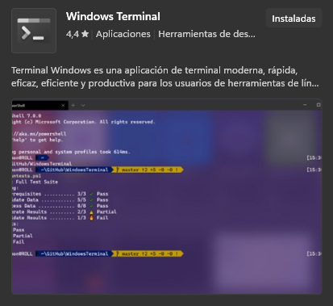
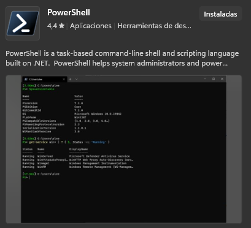
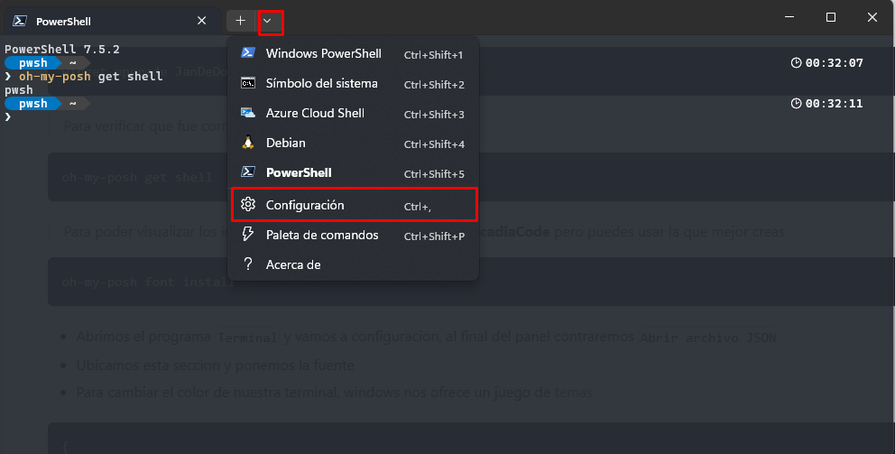
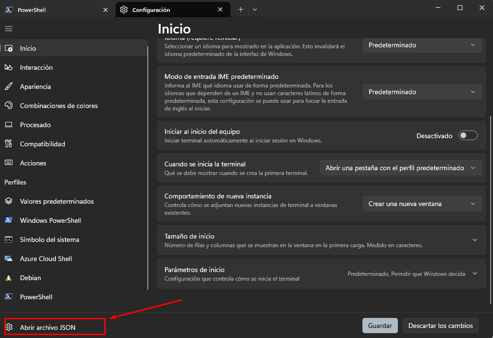

# Configuraciones

## General Settings

Estas son las configuraciones generales que siempre uso al momento de adaptar el vsCode a mi estilo de desarrollo

```json
{
  "workbench.colorTheme": "Default Dark Modern",
  "workbench.activityBar.location": "top",
  "workbench.tree.enableStickyScroll": true,
  "workbench.editor.empty.hint": "hidden",
  "workbench.layoutControl.enabled": false,
  "workbench.navigationControl.enabled": false,
  "editor.stickyScroll.enabled": true,
  "editor.tabSize": 2,
  "editor.minimap.maxColumn": 80,
  "editor.cursorBlinking": "expand",
  "editor.linkedEditing": true,
  "editor.formatOnSave": true,
  "editor.defaultFormatter": "esbenp.prettier-vscode",
  "editor.inlineSuggest.showToolbar": "onHover",
  "editor.peekWidgetDefaultFocus": "editor",
  "explorer.compactFolders": false,
  "breadcrumbs.enabled": false,
  "terminal.integrated.stickyScroll.enabled": true,
  "window.zoomLevel": 1,
  "window.menuBarVisibility": "compact",
  "window.commandCenter": false,
  "window.density.editorTabHeight": "compact",
  "git.autofetch": "all",
  "git.autofetchPeriod": 900,
  "git.pullBeforeCheckout": true,
  "git.branchProtection": ["develop", "dev", "stage", "main", "master"],
  "typescript.preferences.useAliasesForRenames": false,
  "telemetry.feedback.enabled": false,
  "telemetry.telemetryLevel": "off",
  "accessibility.signalOptions.volume": 0,
  "emmet.includeLanguages": {
    "javascript": "javascriptreact",
    "typescript": "typescriptreact"
  }
}
```

## Custom Labels

`setting.json`

```json
  "workbench.editor.customLabels.patterns": {
    "**/*": "${dirname}/${filename}.${extname}"
  },
```

:::info
En **VsCode** puedes configurar custom label patterns para mostrar el nombre del archivo junto con su carpeta contenedora.
Esto se conoce como [customize-tab-labels](https://code.visualstudio.com/docs/getstarted/userinterface#_customize-tab-labels)
:::

## File Nesting

<details>
  <summary>
    `setting.json`
  </summary>

```json
{
  "explorer.fileNesting.expand": false,
  "explorer.fileNesting.enabled": true,
  "explorer.fileNesting.patterns": {
    ".env": "*.env, .env.*, .envrc, env.d.ts",
    ".gitignore": ".gitattributes, .gitmodules, .gitmessage, .lfsconfig, .mailmap, .git-blame*",
    "app.config.*": "*.env, .babelrc*, .codecov, .cssnanorc*, .env.*, .envrc, .htmlnanorc*, .lighthouserc.*, .mocha*, .postcssrc*, .terserrc*, api-extractor.json, ava.config.*, babel.config.*, capacitor.config.*, content.config.*, contentlayer.config.*, cssnano.config.*, cypress.*, env.d.ts, formkit.config.*, formulate.config.*, histoire.config.*, htmlnanorc.*, i18n.config.*, ionic.config.*, jasmine.*, jest.config.*, jsconfig.*, karma*, lighthouserc.*, panda.config.*, playwright.config.*, postcss.config.*, puppeteer.config.*, react-router.config.*, rspack.config.*, sst.config.*, svgo.config.*, tailwind.config.*, tsconfig.*, tsdoc.*, uno.config.*, unocss.config.*, vitest.config.*, vuetify.config.*, webpack.config.*, windi.config.*",
    "astro.config.*": "*.env, .babelrc*, .codecov, .cssnanorc*, .env.*, .envrc, .htmlnanorc*, .lighthouserc.*, .mocha*, .postcssrc*, .terserrc*, api-extractor.json, ava.config.*, babel.config.*, capacitor.config.*, content.config.*, contentlayer.config.*, cssnano.config.*, cypress.*, env.d.ts, formkit.config.*, formulate.config.*, histoire.config.*, htmlnanorc.*, i18n.config.*, ionic.config.*, jasmine.*, jest.config.*, jsconfig.*, karma*, lighthouserc.*, panda.config.*, playwright.config.*, postcss.config.*, puppeteer.config.*, react-router.config.*, rspack.config.*, sst.config.*, svgo.config.*, tailwind.config.*, tsconfig.*, tsdoc.*, uno.config.*, unocss.config.*, vitest.config.*, vuetify.config.*, webpack.config.*, windi.config.*",
    "composer.json": ".php*.cache, composer.lock, phpunit.xml*, psalm*.xml",
    "deno.json*": "*.env, .env.*, .envrc, api-extractor.json, deno.lock, env.d.ts, import-map.json, import_map.json, jsconfig.*, tsconfig.*, tsdoc.*",
    "Dockerfile": "*.dockerfile, .devcontainer.*, .dockerignore, captain-definition, compose.*, docker-compose.*, dockerfile*",
    "gatsby-config.*": "*.env, .babelrc*, .codecov, .cssnanorc*, .env.*, .envrc, .htmlnanorc*, .lighthouserc.*, .mocha*, .postcssrc*, .terserrc*, api-extractor.json, ava.config.*, babel.config.*, capacitor.config.*, content.config.*, contentlayer.config.*, cssnano.config.*, cypress.*, env.d.ts, formkit.config.*, formulate.config.*, gatsby-browser.*, gatsby-node.*, gatsby-ssr.*, gatsby-transformer.*, histoire.config.*, htmlnanorc.*, i18n.config.*, ionic.config.*, jasmine.*, jest.config.*, jsconfig.*, karma*, lighthouserc.*, panda.config.*, playwright.config.*, postcss.config.*, puppeteer.config.*, react-router.config.*, rspack.config.*, sst.config.*, svgo.config.*, tailwind.config.*, tsconfig.*, tsdoc.*, uno.config.*, unocss.config.*, vitest.config.*, vuetify.config.*, webpack.config.*, windi.config.*",
    "next.config.*": "*.env, .babelrc*, .codecov, .cssnanorc*, .env.*, .envrc, .htmlnanorc*, .lighthouserc.*, .mocha*, .postcssrc*, .terserrc*, api-extractor.json, ava.config.*, babel.config.*, capacitor.config.*, content.config.*, contentlayer.config.*, cssnano.config.*, cypress.*, env.d.ts, formkit.config.*, formulate.config.*, histoire.config.*, htmlnanorc.*, i18n.config.*, ionic.config.*, jasmine.*, jest.config.*, jsconfig.*, karma*, lighthouserc.*, next-env.d.ts, next-i18next.config.*, panda.config.*, playwright.config.*, postcss.config.*, puppeteer.config.*, react-router.config.*, rspack.config.*, sst.config.*, svgo.config.*, tailwind.config.*, tsconfig.*, tsdoc.*, uno.config.*, unocss.config.*, vitest.config.*, vuetify.config.*, webpack.config.*, windi.config.*",
    "package.json": "*.code-workspace, .browserslist*, .circleci*, .commitlint*, .cspell*, .cursor*, .cz-config.js, .czrc, .dlint.json, .dprint.json*, .editorconfig, .eslint*, .firebase*, .flowconfig, .github*, .gitlab*, .gitmojirc.json, .gitpod*, .huskyrc*, .jslint*, .knip.*, .lintstagedrc*, .ls-lint.yml, .markdownlint*, .node-version, .nodemon*, .npm*, .nvmrc, .oxlintrc.json, .oxlintrc.json.bak, .pm2*, .pnp.*, .pnpm*, .prettier*, .pylintrc, .release-please*.json, .releaserc*, .ruff.toml, .sentry*, .shellcheckrc, .simple-git-hooks*, .stackblitz*, .styleci*, .stylelint*, .tazerc*, .textlint*, .tool-versions, .travis*, .versionrc*, .vscode*, .watchman*, .windsurfrules, .xo-config*, .yamllint*, .yarnrc*, Procfile, apollo.config.*, appveyor*, azure-pipelines*, biome.json*, bower.json, build.config.*, bun.lock, bun.lockb, bunfig.toml, colada.options.ts, commitlint*, crowdin*, cspell*, dangerfile*, dlint.json, dprint.json*, ec.config.*, electron-builder.*, eslint*, firebase.json, grunt*, gulp*, jenkins*, knip.*, lerna*, lint-staged*, nest-cli.*, netlify*, nixpacks*, nodemon*, npm-shrinkwrap.json, nx.*, package-lock.json, package.nls*.json, phpcs.xml, pm2.*, pnpm*, prettier*, pullapprove*, pyrightconfig.json, release-please*.json, release-tasks.sh, release.config.*, renovate*, rolldown.config.*, rollup.config.*, rspack*, ruff.toml, sentry.*.config.ts, simple-git-hooks*, sonar-project.properties, stylelint*, taze.config.*, tsdown.config.*, tslint*, tsup.config.*, turbo*, typedoc*, unlighthouse*, vercel*, vetur.config.*, webpack*, workspace.json, wrangler.*, xo.config.*, yarn*",
    "readme*": "AUTHORS, Authors, BACKERS*, Backers*, CHANGELOG*, CITATION*, CODEOWNERS, CODE_OF_CONDUCT*, CONTRIBUTING*, CONTRIBUTORS, COPYING*, CREDITS, Changelog*, Citation*, Code_Of_Conduct*, Codeowners, Contributing*, Contributors, Copying*, Credits, GOVERNANCE.MD, Governance.md, HISTORY.MD, History.md, LICENSE*, License*, MAINTAINERS, Maintainers, README-*, README_*, RELEASE_NOTES*, ROADMAP.MD, Readme-*, Readme_*, Release_Notes*, Roadmap.md, SECURITY.MD, SPONSORS*, Security.md, Sponsors*, authors, backers*, changelog*, citation*, code_of_conduct*, codeowners, contributing*, contributors, copying*, credits, governance.md, history.md, license*, maintainers, readme-*, readme_*, release_notes*, roadmap.md, security.md, sponsors*",
    "Readme*": "AUTHORS, Authors, BACKERS*, Backers*, CHANGELOG*, CITATION*, CODEOWNERS, CODE_OF_CONDUCT*, CONTRIBUTING*, CONTRIBUTORS, COPYING*, CREDITS, Changelog*, Citation*, Code_Of_Conduct*, Codeowners, Contributing*, Contributors, Copying*, Credits, GOVERNANCE.MD, Governance.md, HISTORY.MD, History.md, LICENSE*, License*, MAINTAINERS, Maintainers, README-*, README_*, RELEASE_NOTES*, ROADMAP.MD, Readme-*, Readme_*, Release_Notes*, Roadmap.md, SECURITY.MD, SPONSORS*, Security.md, Sponsors*, authors, backers*, changelog*, citation*, code_of_conduct*, codeowners, contributing*, contributors, copying*, credits, governance.md, history.md, license*, maintainers, readme-*, readme_*, release_notes*, roadmap.md, security.md, sponsors*",
    "README*": "AUTHORS, Authors, BACKERS*, Backers*, CHANGELOG*, CITATION*, CODEOWNERS, CODE_OF_CONDUCT*, CONTRIBUTING*, CONTRIBUTORS, COPYING*, CREDITS, Changelog*, Citation*, Code_Of_Conduct*, Codeowners, Contributing*, Contributors, Copying*, Credits, GOVERNANCE.MD, Governance.md, HISTORY.MD, History.md, LICENSE*, License*, MAINTAINERS, Maintainers, README-*, README_*, RELEASE_NOTES*, ROADMAP.MD, Readme-*, Readme_*, Release_Notes*, Roadmap.md, SECURITY.MD, SPONSORS*, Security.md, Sponsors*, authors, backers*, changelog*, citation*, code_of_conduct*, codeowners, contributing*, contributors, copying*, credits, governance.md, history.md, license*, maintainers, readme-*, readme_*, release_notes*, roadmap.md, security.md, sponsors*",
    "vite.config.*": "*.env, .babelrc*, .codecov, .cssnanorc*, .env.*, .envrc, .htmlnanorc*, .lighthouserc.*, .mocha*, .postcssrc*, .terserrc*, api-extractor.json, ava.config.*, babel.config.*, capacitor.config.*, content.config.*, contentlayer.config.*, cssnano.config.*, cypress.*, env.d.ts, formkit.config.*, formulate.config.*, histoire.config.*, htmlnanorc.*, i18n.config.*, ionic.config.*, jasmine.*, jest.config.*, jsconfig.*, karma*, lighthouserc.*, panda.config.*, playwright.config.*, postcss.config.*, puppeteer.config.*, react-router.config.*, rspack.config.*, sst.config.*, svgo.config.*, tailwind.config.*, tsconfig.*, tsdoc.*, uno.config.*, unocss.config.*, vitest.config.*, vuetify.config.*, webpack.config.*, windi.config.*",
    "*.cjs": "$(capture).cjs.map, $(capture).*.cjs, $(capture)_*.cjs",
    "*.component.ts": "$(capture).component.html, $(capture).component.spec.ts, $(capture).component.css, $(capture).component.scss, $(capture).component.sass, $(capture).component.less",
    "*.css": "$(capture).css.map, $(capture).*.css",
    "*.dart": "$(capture).freezed.dart, $(capture).g.dart",
    "*.db": "*.db-shm, *.db-wal",
    "*.js": "$(capture).js.map, $(capture).*.js, $(capture)_*.js, $(capture).d.ts, $(capture).d.ts.map, $(capture).js.flow",
    "*.jsx": "$(capture).js, $(capture).*.jsx, $(capture)_*.js, $(capture)_*.jsx, $(capture).css, $(capture).module.css, $(capture).less, $(capture).module.less, $(capture).module.less.d.ts, $(capture).scss, $(capture).module.scss, $(capture).module.scss.d.ts",
    "*.md": "$(capture).*",
    "*.mjs": "$(capture).mjs.map, $(capture).*.mjs, $(capture)_*.mjs",
    "*.module.ts": "$(capture).resolver.ts, $(capture).controller.ts, $(capture).service.ts",
    "*.py": "$(capture).pyi",
    "*.ts": "$(capture).js, $(capture).d.ts.map, $(capture).*.ts, $(capture)_*.js, $(capture)_*.ts",
    "*.tsx": "$(capture).ts, $(capture).*.tsx, $(capture)_*.ts, $(capture)_*.tsx, $(capture).css, $(capture).module.css, $(capture).less, $(capture).module.less, $(capture).module.less.d.ts, $(capture).scss, $(capture).module.scss, $(capture).module.scss.d.ts, $(capture).css.ts",
    "*.xaml": "$(capture).xaml.cs"
  }
}
```

</details>

:::info
En **VsCode** tenemos la posibilidad de agrupar archivos en archivos pricipales, como si fueran carpetas, pero estos arcchivos fisicamente estan la misma posicion, esto se logra con la opcion [explorer-file-nesting](https://code.visualstudio.com/updates/v1_67#_explorer-file-nesting)
:::

## Cambiar la fuente

Para poder cambiar la fuente del editor, debemos de instalar o tener la fuente en nuestro sistema

En este ejemplo utilizaremos [Cascadia Code](https://github.com/microsoft/cascadia-code/releases) de **Microsoft**.

- Debemos descargar la fuente en formato `.ttf`
- Luego le damos doble click para instalar
- Despues de que este instala en nuestro sistema debemos activar la fuente en el editor, asi como el soporte de ligaduras si la fuente lo soporta
- Luego se debe de reiniciar el editor completamente y ya lo tendremos listo.

`setting.json`

```json
{
  "editor.fontFamily": "'Cascadia Code',Consolas, 'Courier New', monospace",
  "editor.fontLigatures": true,
  "editor.fontWeight": "400"
}
```

## Cambiar la terminal

> Lo primero que debemos de hacer para actualizar nuestra terminal en windows, es dirigirnos a la `Microsoft Store` y buscar un programa que facilita el manejo de varias terminales `Terminal` y adicionalmente actualizar la `Power Shell` que trae por defecto **windows** Asi que la buscamos y la instalamos.

<p align="center" >


</p>

:::note
Para lograr esta actualizacion de terminal nos basaremos en el programa **[ohmyposh](https://ohmyposh.dev/)** que es una shell que se puede conectar con otra a bajo nivel y esta permite configuraciones visuales

:::

> Para instalarla desde consola
>
> > luego reiniciar la terminal

```bash
winget install JanDeDobbeleer.OhMyPosh -s winget
```

> Para buscar actualizaciones

```bash
winget upgrade JanDeDobbeleer.OhMyPosh -s winget
```

> Para verificar que fue correctamente instalado

```bash
oh-my-posh get shell
```

> Para poder visualizar los iconos en la terminal, se recomienda **CascadiaCode** pero puedes usar la que mejor creas

```bash
oh-my-posh font install
```

> Abrimos el programa `Terminal` y vamos a configuracion, al final del panel contraremos `Abrir archivo JSON`




> Ubicamos en nuestro archivo `profiles.defaults` alli podremos especificar, el **schema** des listado que tengamos disponible, **tamaño de fuente** y la **opacidad** de la misma
>
> Para modificar los colores de nuestra terminar, **windows** nos ofrece un juego de **[temas](https://learn.microsoft.com/en-us/windows/terminal/customize-settings/color-schemes)**, o si quieres tener una personalizada tambien la puedes crear, aqui utilizamos una variante de [One Half Dark](https://learn.microsoft.com/en-us/windows/terminal/customize-settings/color-schemes#one-half-dark)

```json
{
  "profiles": {
    "defaults": {
      "colorScheme": "One Half Dark (modified)",
      "font":
      {
          "face": "CaskaydiaCove Nerd Font",
          "size": 10
      },
      "opacity": 90
    },
    "sheme"[{
      "background": "#282C34",
      "black": "#282C34",
      "blue": "#1652B9",
      "brightBlack": "#5A6374",
      "brightBlue": "#61AFEF",
      "brightCyan": "#56B6C2",
      "brightGreen": "#5AF78E",
      "brightPurple": "#C678DD",
      "brightRed": "#FF5C57",
      "brightWhite": "#DCDFE4",
      "brightYellow": "#E5C07B",
      "cursorColor": "#FFFFFF",
      "cyan": "#56B6C2",
      "foreground": "#DCDFE4",
      "green": "#5AF78E",
      "name": "One Half Dark (modified)",
      "purple": "#C678DD",
      "red": "#FF5C57",
      "selectionBackground": "#FFFFFF",
      "white": "#DCDFE4",
      "yellow": "#E5C07B"
    }]
  }
}
```

> Ya con nuestra terminal configurada visualmente, Debemos crear un perfil de configuracion de **oh-my-posh**

```bash
New-Item -Path $PROFILE -Type File -Force
```

> Abrimos nuestro archivo para editarlo

```bash
notepad $PROFILE
```

> Este archivo sera el invocado como primer comando al momento te montar una terminal de **powerShell** y alli indicaremos que ejecute **oh-my-posh** como terminar intermedia sin configuraciones personalizadas

```bash
>> oh-my-posh init pwsh | Invoke-Expression
```

> Aqui ya puedes reiniciar la terminal y ver la ejecucion basica de **oh-my-posh** en tu **powerShell** configurada
>
> Si queremos cambiar el **theme** de **oh-my-posh**, debemos descargar los temas disponibles

```bash
Get-PoshThemes
```

> Luego debes de actualizar tu archivo `$PROFILE` de la siguiente manera, usando el `--config` y agregando la ruta de tu tema, incluso puede ser una ruta personalizada

```bash
oh-my-posh init pwsh --config 'C:\Users\AppData\Local\Programs\oh-my-posh\themes\jandedobbeleer.omp.json' | Invoke-Expression
```

<details>
  <summary>
  custom.omp.json
  </summary>
  ```json
  {
  "$schema": "https://raw.githubusercontent.com/JanDeDobbeleer/oh-my-posh/main/themes/schema.json",
  "blocks": [
    {
      "type": "prompt",
      "alignment": "left",
      "segments": [
        {
          "properties": {
            "cache_duration": "none"
          },
          "leading_diamond": "\ue0b6",
          "template": " {{ .Name }} ",
          "foreground": "#ffffff",
          "background": "#0077c2",
          "type": "shell",
          "style": "diamond"
        },
        {
          "properties": {
            "cache_duration": "none",
            "root_icon": "\uf292"
          },
          "template": "<parentBackground>\ue0b0</> \uf0e7 ",
          "foreground": "#FFFB38",
          "background": "#ef5350",
          "type": "root",
          "style": "diamond"
        },
        {
          "properties": {
            "cache_duration": "none",
            "style": "full"
          },
          "template": " {{ .Path }} ",
          "foreground": "#E4E4E4",
          "powerline_symbol": "\ue0b0",
          "background": "#444444",
          "type": "path",
          "style": "powerline"
        },
        {
          "properties": {
            "branch_icon": "\ue725 ",
            "cache_duration": "none",
            "fetch_status": true,
            "fetch_upstream_icon": true
          },
          "template": " {{ .HEAD }} {{ if .Working.Changed }}{{ .Working.String }}{{ end }}{{ if and (.Working.Changed) (.Staging.Changed) }} |{{ end }}{{ if .Staging.Changed }}<#ef5350> \uf046 {{ .Staging.String }}</>{{ end }} ",
          "foreground": "#ffffff",
          "powerline_symbol": "\ue0b0",
          "background": "#0077c2",
          "type": "git",
          "style": "powerline",
          "background_templates": [
            "{{ if or (.Working.Changed) (.Staging.Changed) }}#0077c2{{ end }}",
            "{{ if and (gt .Ahead 0) (gt .Behind 0) }}#0077c2{{ end }}",
            "{{ if gt .Ahead 0 }}#C792EA{{ end }}",
            "{{ if gt .Behind 0 }}#C792EA{{ end }}"
          ]
        }
      ]
    },
    {
      "type": "prompt",
      "alignment": "right",
      "segments": [
        {
          "properties": {
            "cache_duration": "none"
          },
          "leading_diamond": " \ue0b6",
          "trailing_diamond": "\ue0b4",
          "template": "\ue718 {{ if .PackageManagerIcon }}{{ .PackageManagerIcon }} {{ end }}{{ .Full }}",
          "foreground": "#E4E4E4",
          "background": "#3C873A",
          "type": "node",
          "style": "diamond"
        },
        {
          "properties": {
            "cache_duration": "none"
          },
          "leading_diamond": " \ue0b6",
          "trailing_diamond": "\ue0b4",
          "template": " \ue641 {{ .CurrentDate | date .Format }} ",
          "foreground": "#ffffff",
          "background": "transparent",
          "type": "time",
          "style": "diamond",
          "invert_powerline": true
        }
      ]
    },
    {
      "type": "prompt",
      "alignment": "left",
      "segments": [
        {
          "properties": {
            "always_enabled": true,
            "cache_duration": "none"
          },
          "template": "❯ ",
          "foreground": "#e0f8ff",
          "type": "status",
          "style": "plain",
          "foreground_templates": [
            "{{ if gt .Code 0 }}#ef5350{{ end }}"
          ]
        }
      ],
      "newline": true
    }
  ],
  "version": 3
}
````
</details>

> Luego debemos de entrar en los `settings.json` de **VsCode** asignarle por defecto la fuente que descargamos y nuestra `PowerShell` que configuramos para que abra por defecto.

```json
{
  "terminal.integrated.fontFamily": "CaskaydiaCove Nerd Font",
  "terminal.integrated.defaultProfile.windows": "PowerShell"
}
```

> Por ultimo podemos activar un autocompletado mas poderoso que nos entrega nuestra nueva terminal

```bash
$ Set-PSReadLineOption -PredictionViewStyle ListView
```

## Snippets

En **VsCode** tenemos la posiblidad de crear nuestro propioes **[snippets](https://code.visualstudio.com/docs/editing/userdefinedsnippets)**

### JavaScript/TypeScript

| Snippet | Descripción             | Código generado         |
| ------- | ----------------------- | ----------------------- |
| `log`   | Console.log             | `console.log($1)`       |
| `warn`  | Console.warn            | `console.warn($1)`      |
| `error` | Console.error           | `console.error($1)`     |
| `clg`   | Console.log con mensaje | `console.log('$1', $2)` |

### Estructuras de control

| Snippet  | Descripción      | Código generado                                   |
| -------- | ---------------- | ------------------------------------------------- |
| `switch` | Switch case      | `switch ($1) { case $2: $3; break; default: $4 }` |
| `case`   | Case para switch | `case $1: $2; break;`                             |

### Manejo de errores

| Snippet | Descripción       | Código generado                               |
| ------- | ----------------- | --------------------------------------------- |
| `try`   | Try-catch         | `try { $1 } catch ($2) { $3 }`                |
| `tryf`  | Try-catch-finally | `try { $1 } catch ($2) { $3 } finally { $4 }` |

### Objetos y Arrays

| Snippet | Descripción         | Código generado           |
| ------- | ------------------- | ------------------------- |
| `dest`  | Destructuring       | `const { $1 } = $2`       |
| `imp`   | Import destructured | `import { $1 } from '$2'` |

### Métodos de Array

| Snippet  | Descripción  | Código generado                 |
| -------- | ------------ | ------------------------------- |
| `map`    | Array.map    | `$1.map($2 => $3)`              |
| `filter` | Array.filter | `$1.filter($2 => $3)`           |
| `reduce` | Array.reduce | `$1.reduce(($2, $3) => $4, $5)` |
| `find`   | Array.find   | `$1.find($2 => $3)`             |
| `some`   | Array.some   | `$1.some($2 => $3)`             |
| `every`  | Array.every  | `$1.every($2 => $3)`            |

### Snippets específicos de TypeScript

| Snippet | Descripción | Código generado       |
| ------- | ----------- | --------------------- |
| `inter` | Interface   | `interface $1 { $2 }` |
| `type`  | Type alias  | `type $1 = $2`        |
| `enum`  | Enum        | `enum $1 { $2 }`      |

### Snippets para testing

| Snippet      | Descripción    | Código generado                |
| ------------ | -------------- | ------------------------------ |
| `desc`       | Describe block | `describe('$1', () => { $2 })` |
| `it`         | Test case      | `it('$1', () => { $2 })`       |
| `test`       | Test (Jest)    | `test('$1', () => { $2 })`     |
| `expect`     | Expectation    | `expect($1).toBe($2)`          |
| `beforeEach` | Before each    | `beforeEach(() => { $1 })`     |
| `afterEach`  | After each     | `afterEach(() => { $1 })`      |

### Snippets para React

| Snippet | Descripción                    | Código generado                      |
| ------- | ------------------------------ | ------------------------------------ |
| `rc`    | React Arrow Function Component | `const $1 = () => { return ( $2 ) }` |
| `rcs`   | useState hook                  | `const [$1, set$1] = useState($2)`   |
| `rce`   | useEffect hook                 | `useEffect(() => { $1 }, [$2])`      |

### Cómo usar estos snippets

1. **Activación**: Simplemente escribe el snippet y presiona `Tab` o `Enter`
2. **Navegación**: Usa `Tab` para moverte entre los placeholders (`$1`, `$2`, etc.)
3. **Personalización**: Ve a `File > Preferences > Configure User Snippets` para crear los tuyos

> **Nota**: Los snippets se pueden configurar por entorno de extencion del archivo o tambien de manera general.

<details>
  <summary>
  Listado Completo de snippets
  </summary>

```json
{
  "Console Log": {
    "prefix": "log",
    "body": ["console.log('|> $TM_FILENAME:$CLIPBOARD', $1)"],
    "description": "Console.log"
  },
  "Console Warn": {
    "prefix": "warn",
    "body": ["console.warn($1)"],
    "description": "Console.warn"
  },
  "Console Error": {
    "prefix": "error",
    "body": ["console.error($1)"],
    "description": "Console.error"
  },
  "Console Log with message": {
    "prefix": "clg",
    "body": ["console.log('|> $CLIPBOARD', $1)"],
    "description": "Console.log con mensaje"
  },
  "Switch Statement": {
    "prefix": "switch",
    "body": ["switch ($1) {", "\tcase $2:", "\t\t$3", "\t\tbreak;", "\tdefault:", "\t\t$4", "}"],
    "description": "Switch case"
  },
  "Case Statement": {
    "prefix": "case",
    "body": ["case $1:", "\t$2", "\tbreak;"],
    "description": "Case para switch"
  },
  "Try Catch": {
    "prefix": "try",
    "body": ["try {", "\t$1", "} catch ($2) {", "\t$3", "}"],
    "description": "Try-catch"
  },
  "Try Catch Finally": {
    "prefix": "tryf",
    "body": ["try {", "\t$1", "} catch ($2) {", "\t$3", "} finally {", "\t$4", "}"],
    "description": "Try-catch-finally"
  },
  "Destructuring": {
    "prefix": "dest",
    "body": ["const { $1 } = $2"],
    "description": "Destructuring"
  },
  "Import Destructured": {
    "prefix": "imp",
    "body": ["import { $1 } from '$2'"],
    "description": "Import destructured"
  },
  "Array Map": {
    "prefix": "map",
    "body": ["$1.map($2 => $3)"],
    "description": "Array.map"
  },
  "Array Filter": {
    "prefix": "filter",
    "body": ["$1.filter($2 => $3)"],
    "description": "Array.filter"
  },
  "Array Reduce": {
    "prefix": "reduce",
    "body": ["$1.reduce(($2, $3) => $4, $5)"],
    "description": "Array.reduce"
  },
  "Array Find": {
    "prefix": "find",
    "body": ["$1.find($2 => $3)"],
    "description": "Array.find"
  },
  "Array Some": {
    "prefix": "some",
    "body": ["$1.some($2 => $3)"],
    "description": "Array.some"
  },
  "Array Every": {
    "prefix": "every",
    "body": ["$1.every($2 => $3)"],
    "description": "Array.every"
  },
  "Interface": {
    "prefix": "inter",
    "body": ["interface $1 {", "\t$2", "}"],
    "description": "Interface"
  },
  "Type Alias": {
    "prefix": "type",
    "body": ["type $1 = $2"],
    "description": "Type alias"
  },
  "Enum": {
    "prefix": "enum",
    "body": ["enum $1 {", "\t$2", "}"],
    "description": "Enum"
  },
  "Describe Block": {
    "prefix": "desc",
    "body": ["describe('$1', () => {", "\t$2", "})"],
    "description": "Describe block"
  },
  "It Test Case": {
    "prefix": "it",
    "body": ["it('$1', () => {", "\t$2", "})"],
    "description": "Test case"
  },
  "Test Jest": {
    "prefix": "test",
    "body": ["test('$1', () => {", "\t$2", "})"],
    "description": "Test (Jest)"
  },
  "Expect": {
    "prefix": "expect",
    "body": ["expect($1).toBe($2)"],
    "description": "Expectation"
  },
  "Before Each": {
    "prefix": "beforeEach",
    "body": ["beforeEach(() => {", "\t$1", "})"],
    "description": "Before each"
  },
  "After Each": {
    "prefix": "afterEach",
    "body": ["afterEach(() => {", "\t$1", "})"],
    "description": "After each"
  },
  "React Component": {
    "prefix": "rc",
    "body": ["const $1 = () => {", "\treturn (", "\t\t$2", "\t)", "}"],
    "description": "React Arrow Function Component"
  },
  "React useState": {
    "prefix": "rcs",
    "body": ["const [$1, set$1] = useState($2)"],
    "description": "useState hook"
  },
  "React useEffect": {
    "prefix": "rce",
    "body": ["useEffect(() => {", "\t$1", "}, [$2])"],
    "description": "useEffect hook"
  }
}
```

</details>

## Reiniciar vsCode

Debes de eliminar el contenido de dos carpetas, por defecto `vsCode` se instala por usuario, entonces debemos de ir a la siguiente carpeta y eliminar todo su contenido.

```bash
$ C:/user/name/.vsCode
$ C:/user/name/Appdata/Reaming/Code
```
