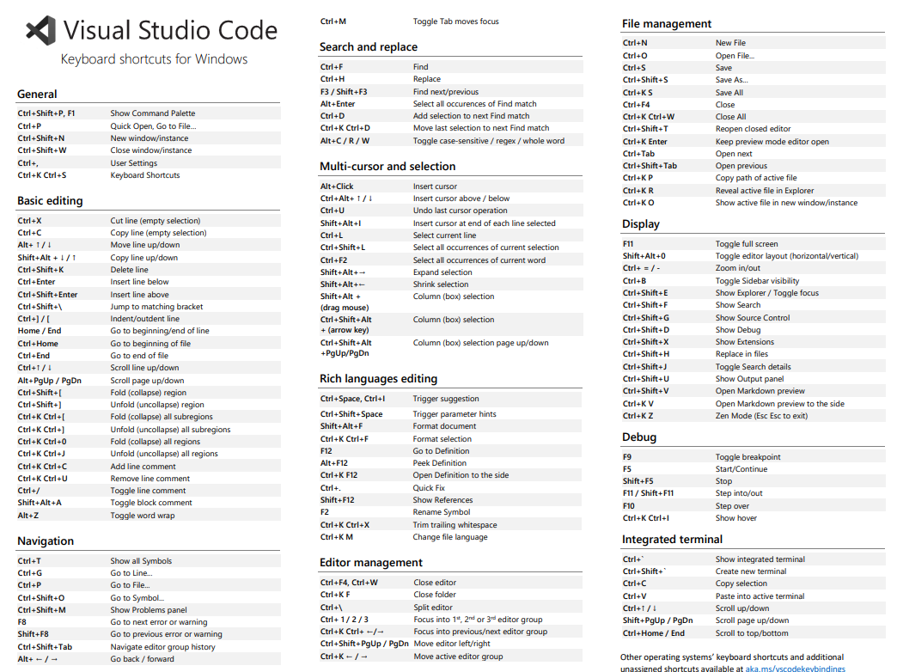

# Atajos de Teclado

Normalmente manejo los atajos tal cual como vienen por defecto

## Commands

Todos estos comandos son los que mas uso, desde el atajo `Ctrl + Shift + p`

| Comando                      | Descripcion                                                                                                                            |
| ---------------------------- | -------------------------------------------------------------------------------------------------------------------------------------- |
| `Sort lines Ascending`       |                                                                                                                                        |
| `Sort lines Decending`       |                                                                                                                                        |
| `Transform to (nameCases..)` | Nos permite transformar texto                                                                                                          |
| `Emmet: Wraper`              | [sintax emmet](https://docs.emmet.io/cheat-sheet/)                                                                                     |
| `translate section`          | si tienes la extecion [Vscode Google Translate](https://marketplace.visualstudio.com/items?itemName=funkyremi.vscode-google-translate) |
| `CodeSnap`                   | Si tienes la extension [codesnap](https://marketplace.visualstudio.com/items?itemName=adpyke.codesnap)                                 |

## [Windows](https://code.visualstudio.com/shortcuts/keyboard-shortcuts-windows.pdf)

### General

| Atajo                | Descripción                      |
| -------------------- | -------------------------------- |
| `Ctrl+Shift+P`, `F1` | Mostrar Paleta de Comandos       |
| `Ctrl+P`             | Apertura Rápida, Ir a Archivo... |
| `Ctrl+Shift+N`       | Nueva ventana/instancia          |
| `Ctrl+Shift+W`       | Cerrar ventana/instancia         |
| `Ctrl+,`             | Configuración de Usuario         |
| `Ctrl+K Ctrl+S`      | Atajos de Teclado                |

### Edición básica

| Atajo               | Descripción                          |
| ------------------- | ------------------------------------ |
| `Ctrl+X`            | Cortar línea (selección vacía)       |
| `Ctrl+C`            | Copiar línea (selección vacía)       |
| `Alt+ ↑ / ↓`        | Mover línea arriba/abajo             |
| `Shift+Alt + ↓ / ↑` | Copiar línea arriba/abajo            |
| `Ctrl+Shift+K`      | Eliminar línea                       |
| `Ctrl+Enter`        | Insertar línea abajo                 |
| `Ctrl+Shift+Enter`  | Insertar línea arriba                |
| `Ctrl+Shift+\`      | Saltar al corchete coincidente       |
| `Ctrl+] / [`        | Indentar/quitar indentación de línea |
| `Home / End`        | Ir al principio/final de línea       |
| `Ctrl+Home`         | Ir al principio del archivo          |
| `Ctrl+End`          | Ir al final del archivo              |
| `Ctrl+↑ / ↓`        | Desplazar línea arriba/abajo         |
| `Alt+PgUp / PgDn`   | Desplazar página arriba/abajo        |
| `Ctrl+Shift+[`      | Contraer región                      |
| `Ctrl+Shift+]`      | Expandir región                      |
| `Ctrl+K Ctrl+[`     | Contraer todas las subregiones       |
| `Ctrl+K Ctrl+]`     | Expandir todas las subregiones       |
| `Ctrl+K Ctrl+0`     | Contraer todas las regiones          |
| `Ctrl+K Ctrl+J`     | Expandir todas las regiones          |
| `Ctrl+K Ctrl+C`     | Agregar comentario de línea          |
| `Ctrl+K Ctrl+U`     | Quitar comentario de línea           |
| `Ctrl+/`            | Alternar comentario de línea         |
| `Shift+Alt+A`       | Alternar comentario de bloque        |
| `Alt+Z`             | Alternar ajuste de línea             |

### Navegación

| Atajo            | Descripción                             |
| ---------------- | --------------------------------------- |
| `Ctrl+T`         | Mostrar todos los Símbolos              |
| `Ctrl+G`         | Ir a Línea...                           |
| `Ctrl+P`         | Ir a Archivo...                         |
| `Ctrl+Shift+O`   | Ir a Símbolo...                         |
| `Ctrl+Shift+M`   | Mostrar panel de Problemas              |
| `F8`             | Ir al siguiente error o advertencia     |
| `Shift+F8`       | Ir al error o advertencia anterior      |
| `Ctrl+Shift+Tab` | Navegar historial del grupo de editores |
| `Alt+ ← / →`     | Ir atrás / adelante                     |
| `Ctrl+M`         | Alternar Tab mueve el foco              |

### Buscar y reemplazar

| Atajo           | Descripción                                                          |
| --------------- | -------------------------------------------------------------------- |
| `Ctrl+F`        | Buscar                                                               |
| `Ctrl+H`        | Reemplazar                                                           |
| `F3 / Shift+F3` | Buscar siguiente/anterior                                            |
| `Alt+Enter`     | Seleccionar todas las ocurrencias de la coincidencia                 |
| `Ctrl+D`        | Agregar selección a la siguiente coincidencia                        |
| `Ctrl+K Ctrl+D` | Mover última selección a la siguiente coincidencia                   |
| `Alt+C / R / W` | Alternar sensible a mayúsculas/minúsculas / regex / palabra completa |

### Multi-cursor y selección

| Atajo                                | Descripción                                              |
| ------------------------------------ | -------------------------------------------------------- |
| `Alt+Click`                          | Insertar cursor                                          |
| `Ctrl+Alt+ ↑ / ↓`                    | Insertar cursor arriba / abajo                           |
| `Ctrl+U`                             | Deshacer última operación de cursor                      |
| `Shift+Alt+I`                        | Insertar cursor al final de cada línea seleccionada      |
| `Ctrl+L`                             | Seleccionar línea actual                                 |
| `Ctrl+Shift+L`                       | Seleccionar todas las ocurrencias de la selección actual |
| `Ctrl+F2`                            | Seleccionar todas las ocurrencias de la palabra actual   |
| `Shift+Alt+→`                        | Expandir selección                                       |
| `Shift+Alt+←`                        | Contraer selección                                       |
| `Shift+Alt + (arrastrar mouse)`      | Selección de columna (caja)                              |
| `Ctrl+Shift+Alt + (tecla de flecha)` | Selección de columna (caja)                              |
| `Ctrl+Shift+Alt +PgUp/PgDn`          | Selección de columna (caja) página arriba/abajo          |

### Edición de lenguajes ricos

| Atajo                  | Descripción                          |
| ---------------------- | ------------------------------------ |
| `Ctrl+Space`, `Ctrl+I` | Activar sugerencia                   |
| `Ctrl+Shift+Space`     | Activar pistas de parámetros         |
| `Shift+Alt+F`          | Formatear documento                  |
| `Ctrl+K Ctrl+F`        | Formatear selección                  |
| `F12`                  | Ir a Definición                      |
| `Alt+F12`              | Vista previa de Definición           |
| `Ctrl+K F12`           | Abrir Definición al lado             |
| `Ctrl+.`               | Corrección Rápida                    |
| `Shift+F12`            | Mostrar Referencias                  |
| `F2`                   | Renombrar Símbolo                    |
| `Ctrl+K Ctrl+X`        | Recortar espacios en blanco al final |
| `Ctrl+K M`             | Cambiar lenguaje del archivo         |

### Gestión del editor

| Atajo                    | Descripción                                        |
| ------------------------ | -------------------------------------------------- |
| `Ctrl+F4`, `Ctrl+W`      | Cerrar editor                                      |
| `Ctrl+K F`               | Cerrar carpeta                                     |
| `Ctrl+\`                 | Dividir editor                                     |
| `Ctrl+ 1 / 2 / 3`        | Enfocar en el 1er, 2do o 3er grupo de editores     |
| `Ctrl+K Ctrl+ ←/→`       | Enfocar en el grupo de editores anterior/siguiente |
| `Ctrl+Shift+PgUp / PgDn` | Mover editor izquierda/derecha                     |
| `Ctrl+K ← / →`           | Mover grupo de editores activo                     |

### Gestión de archivos

| Atajo            | Descripción                                       |
| ---------------- | ------------------------------------------------- |
| `Ctrl+N`         | Nuevo Archivo                                     |
| `Ctrl+O`         | Abrir Archivo...                                  |
| `Ctrl+S`         | Guardar                                           |
| `Ctrl+Shift+S`   | Guardar Como...                                   |
| `Ctrl+K S`       | Guardar Todo                                      |
| `Ctrl+F4`        | Cerrar                                            |
| `Ctrl+K Ctrl+W`  | Cerrar Todo                                       |
| `Ctrl+Shift+T`   | Reabrir editor cerrado                            |
| `Ctrl+K Enter`   | Mantener editor en modo vista previa abierto      |
| `Ctrl+Tab`       | Abrir siguiente                                   |
| `Ctrl+Shift+Tab` | Abrir anterior                                    |
| `Ctrl+K P`       | Copiar ruta del archivo activo                    |
| `Ctrl+K R`       | Revelar archivo activo en el Explorador           |
| `Ctrl+K O`       | Mostrar archivo activo en nueva ventana/instancia |

### Visualización

| Atajo          | Descripción                                      |
| -------------- | ------------------------------------------------ |
| `F11`          | Alternar pantalla completa                       |
| `Shift+Alt+0`  | Alternar diseño del editor (horizontal/vertical) |
| `Ctrl+ = / -`  | Acercar/alejar                                   |
| `Ctrl+B`       | Alternar visibilidad de la Barra Lateral         |
| `Ctrl+Shift+E` | Mostrar Explorador / Alternar foco               |
| `Ctrl+Shift+F` | Mostrar Búsqueda                                 |
| `Ctrl+Shift+G` | Mostrar Control de Código Fuente                 |
| `Ctrl+Shift+D` | Mostrar Depuración                               |
| `Ctrl+Shift+X` | Mostrar Extensiones                              |
| `Ctrl+Shift+H` | Reemplazar en archivos                           |
| `Ctrl+Shift+J` | Alternar detalles de Búsqueda                    |
| `Ctrl+Shift+U` | Mostrar panel de Salida                          |
| `Ctrl+Shift+V` | Abrir vista previa de Markdown                   |
| `Ctrl+K V`     | Abrir vista previa de Markdown al lado           |
| `Ctrl+K Z`     | Modo Zen (Esc Esc para salir)                    |

### Depuración

| Atajo             | Descripción                    |
| ----------------- | ------------------------------ |
| `F9`              | Alternar punto de interrupción |
| `F5`              | Iniciar/Continuar              |
| `Shift+F5`        | Detener                        |
| `F11 / Shift+F11` | Entrar/salir paso a paso       |
| `F10`             | Paso sobre                     |
| `Ctrl+K Ctrl+I`   | Mostrar información al pasar   |

### Terminal integrada

| Atajo               | Descripción                   |
| ------------------- | ----------------------------- |
| `Ctrl+\``           | Mostrar terminal integrada    |
| `Ctrl+Shift+\``     | Crear nueva terminal          |
| `Ctrl+C`            | Copiar selección              |
| `Ctrl+V`            | Pegar en terminal activa      |
| `Ctrl+↑ / ↓`        | Desplazar arriba/abajo        |
| `Shift+PgUp / PgDn` | Desplazar página arriba/abajo |
| `Ctrl+Home / End`   | Desplazar al principio/final  |
